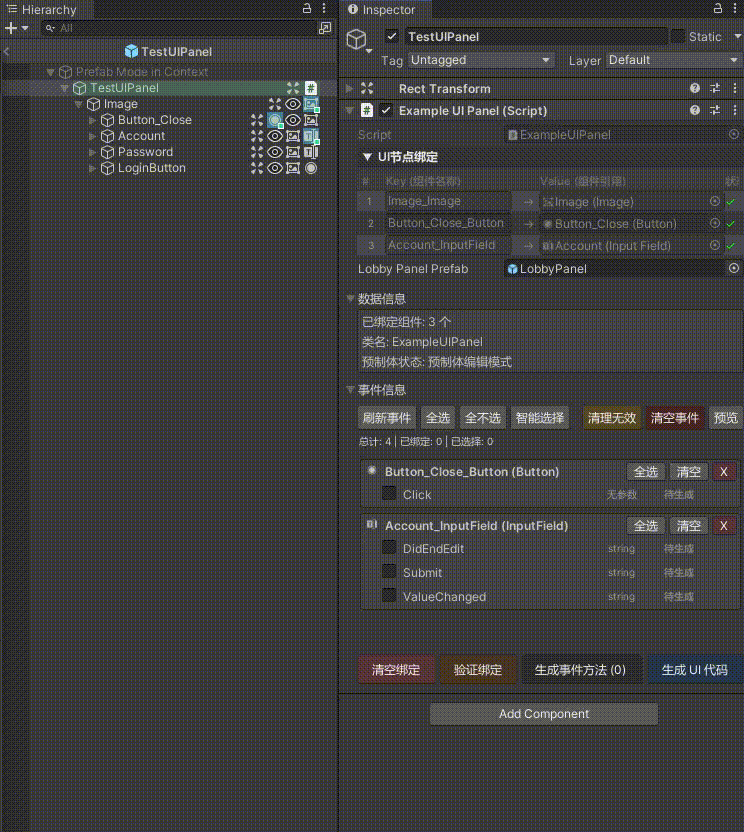

<h1 align="center">AutoUIBinder</h1>
<p align="center">
    <strong>The Ultimate Unity UI Development Tool</strong>
</p>
<p align="center">
    <a href="README.md">English</a> •
    <a href="README_CN.md">中文</a>
</p>

---

> **Stop writing repetitive UI binding code!** AutoUIBinder revolutionizes Unity UI development with visual component binding and automatic code generation.

## What You'll Get

**Transform your UI development workflow from this:**
```csharp
// Manual binding - tedious and error-prone
public Button startButton;
public Text titleText;
public Image backgroundImage;

void Awake() {
    startButton = transform.Find("Button_Start").GetComponent<Button>();
    titleText = transform.Find("Text_Title").GetComponent<Text>();
    // ... manual binding for every component
}
```

**To this simple workflow:**
```csharp
// Just inherit and generate - that's it!
public partial class MyUIPanel : AutoUIBinderBase 
{
    void Start() {
        // All components auto-generated and ready to use
        Button_Start.onClick.AddListener(OnStartClick);
        Text_Title.text = "Welcome!";
    }
}
```

## Quick Start (5 Minutes)

### 3 Steps to Success

#### 1. Create Your UI Script
```csharp
public class MainMenuPanel : AutoUIBinderBase 
{
    // That's it! No manual component declarations needed
}
```

#### 2. Visual Binding
- Attach script to your prefab root
- Enter prefab edit mode  
- **Click the component icons** in Hierarchy - they'll highlight when bound!
- Real-time visual feedback shows binding status

#### 3. Generate & Use
```csharp
// Click "Generate UI Code" in Inspector
// Then use your components immediately:

void Start() {
    Button_Play.onClick.AddListener(() => StartGame());
    Text_PlayerName.text = PlayerPrefs.GetString("name");
    Slider_Volume.value = AudioListener.volume;
}
```

## Event Binding
If you don't want to use the ```Button_Play.onClick.AddListener(() => StartGame());``` approach, you can use the tool's event binding feature.
```csharp
public class GamePanel : AutoUIBinderBase 
{
    [UIEvent("xxxxxxx", "xxxxx")]
    private void OnStartButtonClick()
    {
        // Automatically binds to Button_Start click event
        StartGame();
    }

    [UIEvent("xxxxxxx", "xxxxxx")]
    private void OnVolumeSliderChanged(float value)
    {
        // Automatically binds to Slider_Volume value change
        AudioListener.volume = value;
    }
}
```
## Visual Demonstration

### Visual Component Binding
<p align="center">

</p>
<p>
Click component icons in Hierarchy to bind them instantly - see the visual feedback in real-time!
</p>

> Generated Code:

<p align="center">

</p>
<p>
Comprehensive component references and bindings generated automatically
</p>

<p align="center">

</p>
<p>
Component instances retrieved via dictionary, maintaining O(1) efficiency
</p>

### Automatic Event Binding
<p align="center">

</p>
<p>
AutoUIBinder automatically connects UI events to your methods based on naming conventions
</p>

> Generated Code:

<p align="center">

</p>
<p>
Simple, clean code focused on your game logic
</p>

## User Interface

## Key Features

- **Visual Binding** - Click component icons in Hierarchy to bind instantly  
- **One-Click Generation** - Generate all component references automatically  
- **Smart Naming** - Handles conflicts and invalid characters intelligently  
- **Event Binding** - Auto-connect UI events to your methods  
- **Zero Configuration** - Works out of the box with sensible defaults

## Project Structure

```
Assets/
├── AutoUIBinder/                # Core tool
│   ├── Core/                    # Core implementation
│   │   ├── Runtime/            # Runtime code
│   │   │   ├── Attributes/     # Attribute definitions
│   │   │   ├── Base/          # Base classes
│   │   │   └── Utils/         # Utility classes
│   │   └── Editor/             # Editor code
│   │       ├── Config/         # Configuration
│   │       ├── Core/          # Core editor functionality
│   │       └── Drawers/       # Custom drawers
│   └── Examples/               # Example code
├── Scripts/                    # Your project scripts
│   └── Gen/                   # Generated code (auto-created)
└── Resources/                 # Resource files
    └── GlobalConfig.asset     # Global configuration
```

## Configuration

### Global Settings

Configure code generation path in `Resources/GlobalConfig.asset`:

1. Click "Select Folder" in Inspector
2. Choose your script directory (usually `Assets/Scripts`)
3. Generated code will be saved in `{path}/Gen/{className}/`

### Code Generation Rules

- **Generated file naming:** `{className}Gen.cs`
- **Uses partial class pattern** - won't overwrite your main code
- **Component property naming:** `{NodeName}_{ComponentType}`

## Interface Features

### Enhanced Hierarchy Window

- **Background Color Coding** - Different colors for different AutoUIBinderBase types
- **Component Icons** - Visual indicators for all UI components
- **Binding Status** - Special highlighting for bound components
- **Interactive Binding** - Click icons to bind/unbind instantly

### Improved Inspector Panel

- **Component Reference Table** - Clean overview of all bound components
- **One-Click Generation** - Prominent "Generate UI Code" button
- **Real-time Validation** - Automatically detects and reports invalid references
- **Binding Statistics** - Shows bound/total component counts

<p align="center">

</p>

## Advanced Features

### Smart Naming System

AutoUIBinder intelligently handles:

- **Duplicate Detection** - Auto-adds numeric suffixes for duplicate names
- **Invalid Characters** - Auto-replaces spaces and special characters
- **C# Keyword Conflicts** - Avoids using reserved keywords as variable names
- **User Confirmation** - Interactive dialogs for naming conflicts

### Performance Optimizations

- **Event-Driven Architecture** - Responsive to Unity's event system
- **Memory Efficient** - Minimal runtime overhead

### Robust Error Handling

- **Graceful Recovery** - Auto-recovers binding state after editor restart
- **Validation Checks** - Prevents common binding errors before they occur
- **User-Friendly Messages** - Clear, actionable error descriptions

## Best Practices

### Component Organization
- Keep UI hierarchies clean and organized
- Use empty GameObjects as containers for logical grouping
- Name GameObjects consistently across different panels

### Code Structure
- Keep your main UI class focused on game logic
- Use the generated partial class for component references
- Leverage event binding for clean separation of concerns

## Contributing

**We welcome community contributions!**

- **Report Bugs** - Help us improve by reporting issues
- **Suggest Features** - Share your ideas for new functionality
- **Submit Pull Requests** - Contribute code improvements
- **Star the Project** - Show your support and help others discover AutoUIBinder

## License

MIT License - see [LICENSE](LICENSE) for details.

---

<p align="center">
    <strong>AutoUIBinder - Making Unity UI Development a Breeze!</strong>
</p>