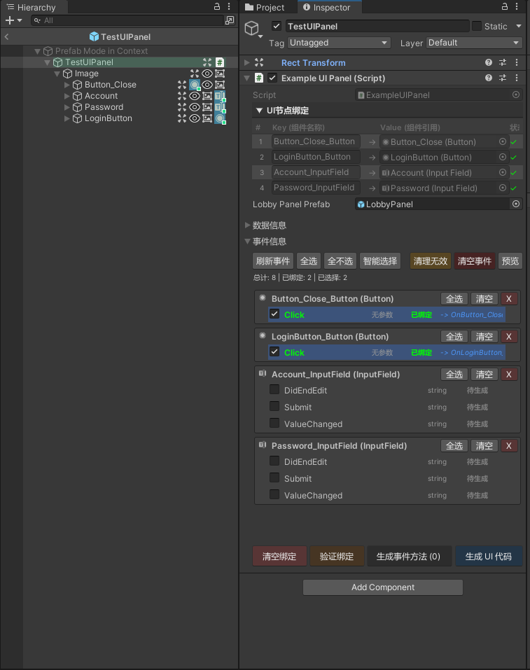

<h1 align="center">AutoUIBinder</h1>
<p align="center">
    <strong>Unity UI开发的终极利器</strong>
</p>
<p align="center">
    <a href="README.md">English</a> •
    <a href="README_CN.md">中文</a>
</p>

---

> **告别繁琐的UI绑定代码！** AutoUIBinder通过可视化组件绑定和自动代码生成，彻底改变你的Unity UI开发方式。

## 你将获得什么

**从这种繁琐的开发模式：**
```csharp
// 手动绑定 - 繁琐且容易出错
public Button startButton;
public Text titleText;
public Image backgroundImage;

void Awake() {
    startButton = transform.Find("Button_Start").GetComponent<Button>();
    titleText = transform.Find("Text_Title").GetComponent<Text>();
    // ... 每个组件都要手动绑定
}
```

**转变为这种简洁的工作流：**
```csharp
// 只需继承并生成 - 就这么简单！
public partial class MyUIPanel : AutoUIBinderBase 
{
    void Start() {
        // 所有组件自动生成，直接使用
        Button_Start.onClick.AddListener(OnStartClick);
        Text_Title.text = "欢迎使用！";
    }
}
```

## 5分钟快速上手

### 3步完成UI绑定

#### 1. 创建UI脚本
```csharp
public class MainMenuPanel : AutoUIBinderBase 
{
    // 就这么简单！无需手动声明组件
}
```

#### 2. 可视化绑定
- 将脚本挂载到预制体根对象
- 进入预制体编辑模式  
- **点击Hierarchy中的组件图标** - 绑定时会高亮显示！
- 实时视觉反馈显示绑定状态

#### 3. 生成代码并使用
```csharp
// 点击Inspector中的"生成UI代码"按钮
// 然后立即使用你的组件：

void Start() {
    Button_Play.onClick.AddListener(() => StartGame());
    Text_PlayerName.text = PlayerPrefs.GetString("name");
    Slider_Volume.value = AudioListener.volume;
}
```

## 事件绑定
如果不想使用```Button_Play.onClick.AddListener(() => StartGame());```这种方式，可以使用工具提供的事件绑定。
```csharp
public class GamePanel : AutoUIBinderBase 
{
    [UIEvent("xxxxxxx", "xxxxx")]
    private void OnStartButtonClick()
    {
        // 自动绑定到Button_Start的点击事件
        StartGame();
    }

    [UIEvent("xxxxxxx", "xxxxxx")]
    private void OnVolumeSliderChanged(float value)
    {
        // 自动绑定到Slider_Volume的值改变事件
        AudioListener.volume = value;
    }
}
```
## 实际效果演示

### 可视化组件绑定
<p align="center">

</p>
<p>
点击Hierarchy中的组件图标即可瞬间绑定 - 实时视觉反馈让绑定过程一目了然！
</p>

> 自动生成的代码：

<p align="center">

</p>
<p>
全面的组件引用和绑定代码，自动生成无需手写
</p>

<p align="center">

</p>
<p>
组件实例通过字典获取，维持(O1)效率
</p>

### 自动事件绑定
<p align="center">

</p>
<p>
AutoUIBinder根据命名约定自动将UI事件连接到你的方法
</p>


> 自动生成的代码：

<p align="center">

</p>
<p>
简洁明了的代码，专注于游戏逻辑
</p>

## 用户界面

## 核心特性

- **可视化绑定** - 点击Hierarchy中的组件图标即可瞬间绑定  
- **一键生成** - 自动生成所有组件引用代码  
- **智能命名** - 智能处理冲突和非法字符  
- **事件绑定** - 自动连接UI事件到你的方法  
- **零配置** - 开箱即用，无需复杂设置

## 项目结构

```
Assets/
├── AutoUIBinder/                # 核心工具
│   ├── Core/                    # 核心实现
│   │   ├── Runtime/            # 运行时代码
│   │   │   ├── Attributes/     # 特性定义
│   │   │   ├── Base/          # 基础类
│   │   │   └── Utils/         # 工具类
│   │   └── Editor/             # 编辑器代码
│   │       ├── Config/         # 配置相关
│   │       ├── Core/          # 核心编辑器功能
│   │       └── Drawers/       # 自定义绘制器
│   └── Examples/               # 示例代码
├── Scripts/                    # 你的项目脚本
│   └── Gen/                   # 生成的代码（自动创建）
└── Resources/                 # 资源文件
    └── GlobalConfig.asset     # 全局配置
```

## 配置说明

### 全局配置

在`Resources/GlobalConfig.asset`中配置代码生成路径：

1. 在Inspector中点击"选择文件夹"
2. 选择你的脚本目录（通常是`Assets/Scripts`）
3. 生成的代码将保存在`{路径}/Gen/{类名}/`目录下

### 代码生成规则

- **生成的文件命名格式：** `{类名}Gen.cs`
- **使用partial class模式** - 不会覆盖你的主要代码
- **组件属性命名格式：** `{节点名}_{组件类型}`

## 界面功能

### 增强的Hierarchy窗口

- **背景色编码** - 不同类型的AutoUIBinderBase用不同颜色区分
- **组件图标** - 所有UI组件的可视化指示器
- **绑定状态** - 已绑定组件的特殊高亮显示
- **交互式绑定** - 点击图标即可瞬间绑定/解绑

### 改进的Inspector面板

- **组件引用表格** - 清晰展示所有绑定的组件
- **一键生成** - 醒目的"生成UI代码"按钮
- **实时验证** - 自动检测并报告无效引用
- **绑定统计** - 显示已绑定/总计组件数量

<p align="center">

</p>

## 高级功能

### 智能命名系统

AutoUIBinder智能处理：

- **重复检测** - 自动为重复名称添加数字后缀
- **非法字符** - 自动替换空格和特殊字符
- **C#关键字冲突** - 避免使用保留关键字作为变量名
- **用户确认** - 命名冲突时的交互式对话框

### 性能优化

- **事件驱动架构** - 响应Unity的事件系统
- **内存高效** - 最小化运行时开销

### 稳健的错误处理

- **优雅恢复** - 编辑器重启后自动恢复绑定状态
- **验证检查** - 在错误发生前预防常见的绑定错误
- **用户友好消息** - 清晰、可操作的错误描述

## 最佳实践


### 组件组织
- 保持UI层级结构清晰有序
- 使用空的GameObject作为逻辑分组的容器
- 在不同面板间保持GameObject命名的一致性

### 代码结构
- 保持主UI类专注于游戏逻辑
- 使用生成的partial类进行组件引用
- 利用事件绑定实现关注点的清晰分离

## 参与贡献

**我们欢迎社区贡献！**

- **报告Bug** - 帮助我们通过报告问题来改进
- **建议功能** - 分享你对新功能的想法
- **提交Pull Request** - 贡献代码改进
- **给项目加Star** - 表示支持并帮助其他人发现AutoUIBinder

## 开源协议

MIT协议 - 详见[LICENSE](LICENSE)文件。

---

<p align="center">
    <strong>AutoUIBinder - 让Unity UI开发如丝般顺滑！</strong>
</p>